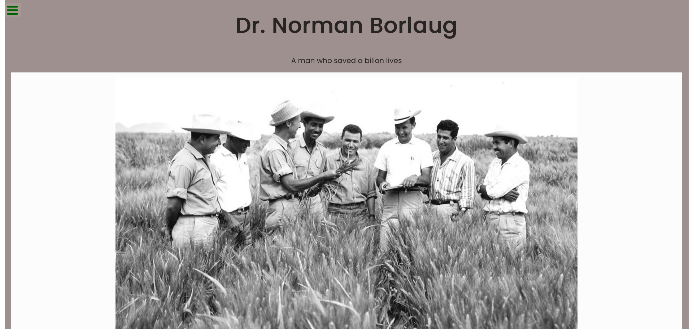

# FreeCodeCamp project - Tribute page

## Table of contents

- [Overview](#overview)
  - [The challenge](#the-challenge)
  - [Screenshot](#screenshot)
  - [Links](#links)
- [My process](#my-process)
  - [Built with](#built-with)
  - [What I learned](#what-i-learned)
- [Author](#author)

## Overview

### The challenge

User should be able to:

- View the optimal layout for the site depending on their device's screen size

To meet all the user stories and practice:

- Adding different types of text to the web page (headings, lists, and links)

- Using bold and italics to emphasize text

- Adding captions to images and embedding them on the page

### Screenshot

### Links

- Live Site URL: [Live site URL here](https://doileo.github.io/tribute-page/)

## My process

### Built with

- Semantic HTML5 markup
- Mobile-first workflow

### What I learned

This project provided me with a great opportunity to learn how to build a simple biography page. The main objective was to meet the user story requirements of FreeCodeCamp.

## Author

- Website - [Doina](https://doileo.github.io/portfolio/)
